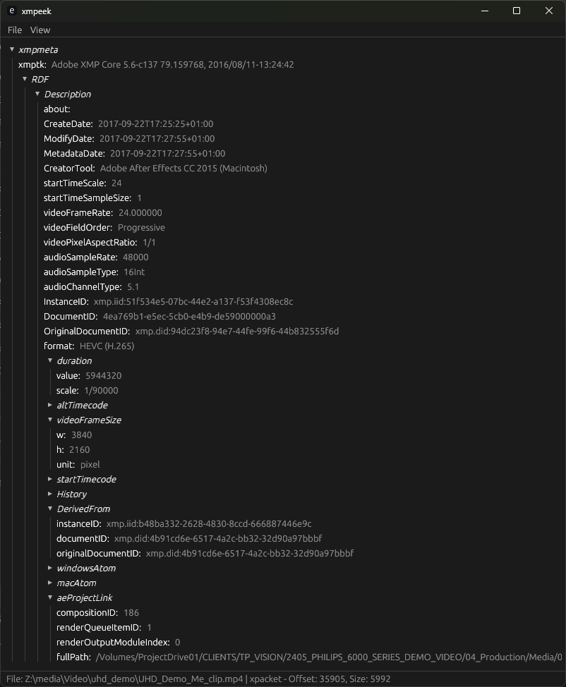

# xmpeek
xmpeek is a tool built using Rust and egui that allows to to display various metadata contained in media files with XMP xpackets embedded(JPG, MP4, PDF..). This allows to learn many interesting information about the origin of media file. The xpacket is most commonly embeded in media created with Adobe products. It supports all formats of files by searching for the packet in the binary data. The packet can be then exported as an .xml file.  

## Installation
Build from source, by downloading the code or cloning the repo and running `cargo build --release`. The binary will be saved in `target/release`. 

## Usage
Run the program and open the file from the `File` -> `Open` menu, or you can specify the file directly from the command line like `xmpeek <INPUT_FILE>`  
This also allows to attach it to the windows context menu or Open in.. menu.

## Issues
This program is not yet fully finished so there might be some issues.  
- Right now there is no indication that the tool is loading the file so it might appear frozen or not running. For big files or slow computers this can take a while so please be patient.  
- The options in `View` menu are not avaliable yet.  
- The tool was not tested on Linux but should work fine.  